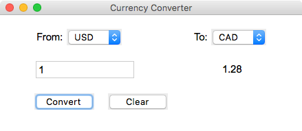

# Currency Converter
This application converts various currencies.  Data for the currency conversion is retrieved from
https://www.ecb.europa.eu/stats/policy_and_exchange_rates/euro_reference_exchange_rates/html/index.en.html 

## Features
    *Simple, yet elegant GUI
    *Powered by the https://ratesapi.io API 
  
## Prerequisites
Python 3.6 or later is required.

Required python modules:

    *forex_python
    *tkinter
  
## Screenshot
widgets

