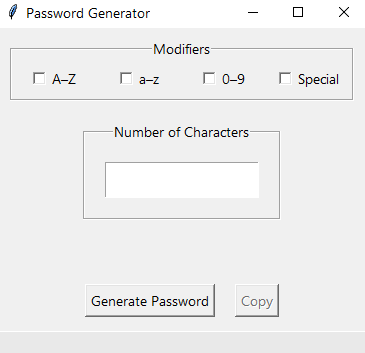
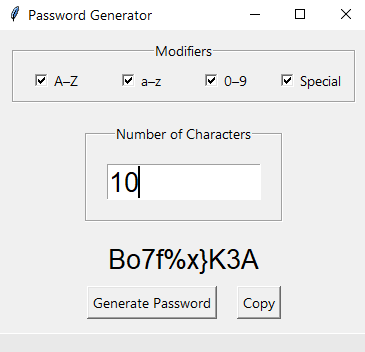

# Password Generator
This app generate passwords that could be used as login information.

## Features
    *Can choose password modifiers such as numbers and special characters
    *Shortcuts include copy (Ctrl+C), paste (Ctrl+V), select all (Ctrl+A), and quit (Ctrl+Q)
  
## Prerequisites
Executable is available for Windows - just download the executable and run the app (Python is not required).

If running from Password_Generator.py, Python 3.6 or later is required. 
  
## Screenshot of App Running on Windows

  

