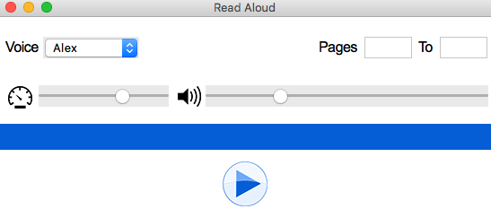
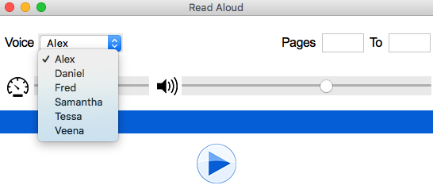
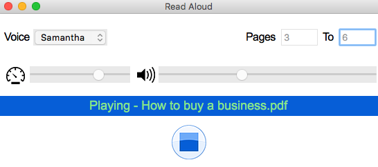

# Read Aloud
This application reads pdf files aloud.

## Features
    *Powered by the pyttsx3 engine
    *Select from 6 voices
    *Page range selection
    *Speech rate adjustment
    *Volume adjustment
    
    Pyttsx3 engine limitations: 
    *Adjustments cannot be made once speech is initiated
    *Speech cannot be paused and resumed—file would be read from the beginning when stopped
    *Pdf files formatted into multiple columns may not be supported
    
   

## Prerequisites
    Required python modules:

    *multiprocessiong (standard library)
    *os (standard library)
    *psutil
    *PyPDF2
    *pyttsx3
    *tkinter
    
    Other requirements:
    
    *Python 3.6 or later
    *CPU with a least a dual core
    *Except for the screenshots, the PGN files must also be downloaded and placed in the same directory as Read_Aloud.py
     
## Screenshots

    

    

