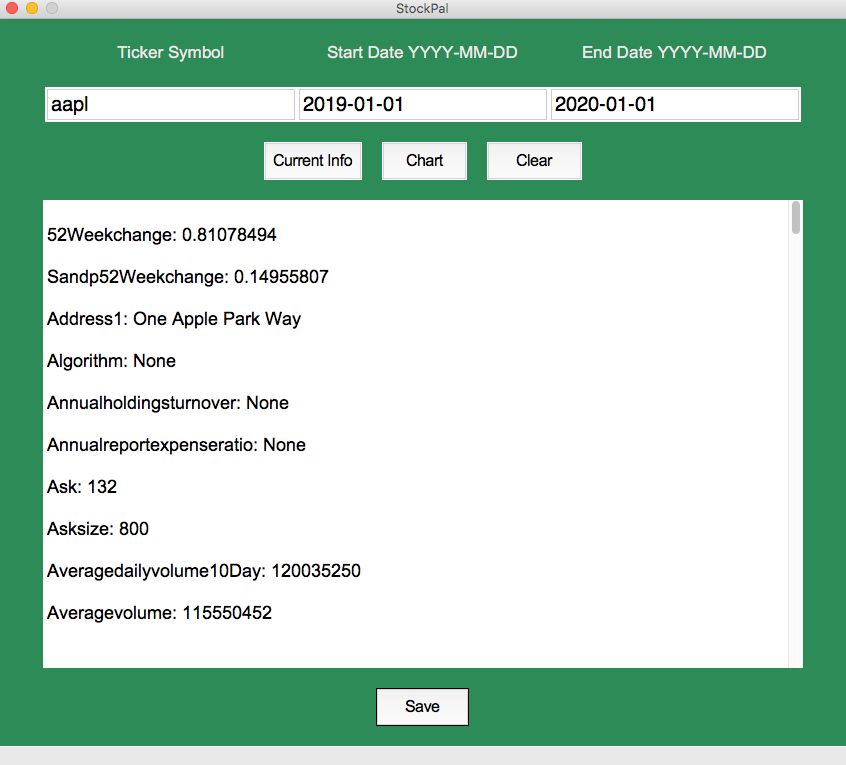
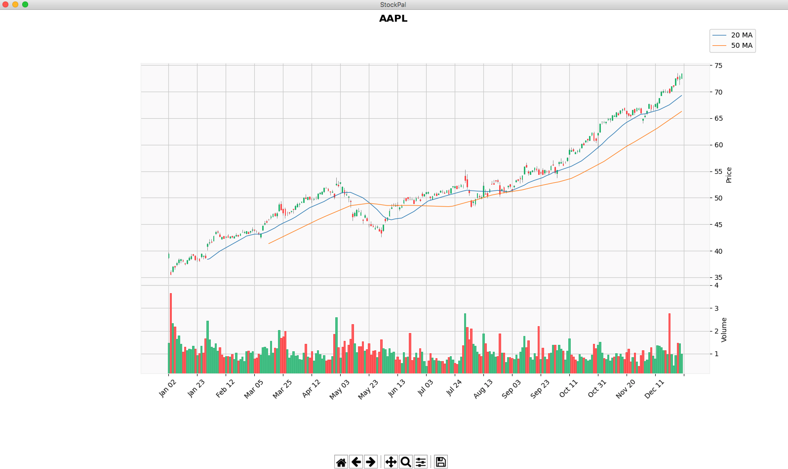

# StockPal

This application retrieves current stock information from Yahoo finance.  The application can also return the ticker's candlestick chart based on a desired time interval.

## Features
    *Powered by the Yahoo Finance API
    *Stock information can be saved in pdf format
    *Candlestick chart includes information on the trading volume and moving averages
    *Chart can be saved in different formats such as png, jpeg, pdf, and tif
    

## Prerequisites
Python 3.6 or later is required.  The StockPal.png and About.png files included in this folder must also be downloaded and placed in the same directory of this script.

Required python modules:

    *pandas
    *pandas_datareader
    *matplotlib
    *mplfinance
    *yfinance
    *tkinter
    *fpdf
  
## Screenshots

